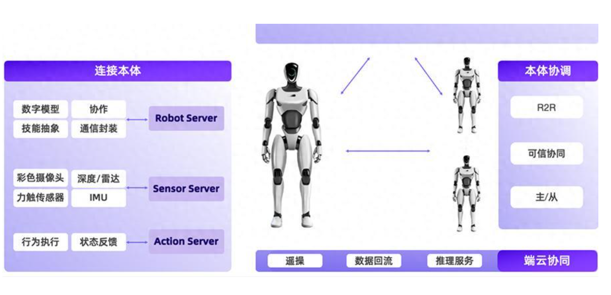

阿里达摩院开源具身智能三件套！
============

* RynnRCP git链接 [github](https://github.com/alibaba-damo-academy/RynnRCP).
* RynnVLA-001 git链接 [github](https://link.zhihu.com/?target=https%3A//github.com/alibaba-damo-academy/RynnVLA-001).
* RynnEC感知 git链接 [in action on my own blog](https://github.com/alibaba-damo-academy/RynnEC).

智东西8月11日报道，在世界机器人大会上，阿里达摩院宣布开源其自研的 VLA（视觉-语言-动作） 模型RynnVLA-001-7B、世界理解模型RynnEC、以及机器人上下文协议RynnRCP，推动数据、模型和机器人的兼容适配，打通具身智能开发全流程。

达摩院将MCP（模型上下文协议）理念引入具身智能，首次提出并开源RCP（Robotics Context Protocol）协议，推出一套完整的机器人服务协议和框架RynnRCP。它类似于一个“万能连接器”，能够打通从传感器数据采集、模型推理到机器人动作执行的完整工作流，目前已支持Pi0、GR00T N1.5等多款热门模型以及SO-100、SO-101等多种机械臂。

RynnRCP是一套完整的机器人服务协议和框架，主要由两个模块组成：RCP框架和RobotMotion。

RCP目前实现的主要功能包括：提供机器人本体及相关传感器能力的抽象，对外提供各种功能，并通过标准协议、不同的传输层和模型服务进行交互；RobotMotion作为云端推理与机器人本体控制之间的桥梁，将离散的低频推理命令实时转换为高频的连续控制信号，驱动机器人完成运动任务。此外，它还配备了运动规划与控制所需的工具包，助力具身智能融入物理世界。

示意图
=======

结语
=======
打通机器人从感知到执行的完整链路
达摩院此次开源的“三件套”——贯通硬件的RynnRCP协议、拟人化操控的RynnVLA模型与理解物理世界的RynnEC模型，如同为具身智能开发者提供了一套“乐高式工具包”。

它们通过标准化连接、拟人化控制与空间认知三大突破，打通了机器人从感知到执行的完整链路，有望在之后迭代的过程中大幅降低开发门槛，加速具身智能在工业、家庭等场景的规模化落地，让机器人真正“看得懂世界，动得像人类”。

Thanks
======

1，[wyl89][jekyll-url]

2，[yumingj][bootstrap-url]

3，[YUXUANMAO][github-url]

4，[Jekyll Clean Theme][Jekyll-Clean-Theme-url]

[jekyll-url]: https://github.com/alibaba-damo-academy/RynnRCP
[bootstrap-url]: https://link.zhihu.com/?target=https%3A//github.com/alibaba-damo-academy/RynnVLA-001
[github-url]: https://github.com/
[Jekyll-Clean-Theme-url]: https://github.com/scotte/jekyll-clean
[xixia-url]: http://xixia.info/